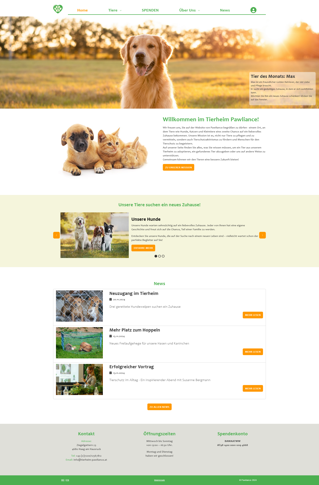
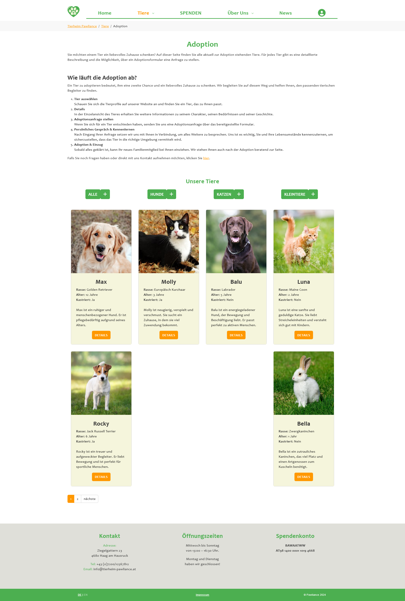
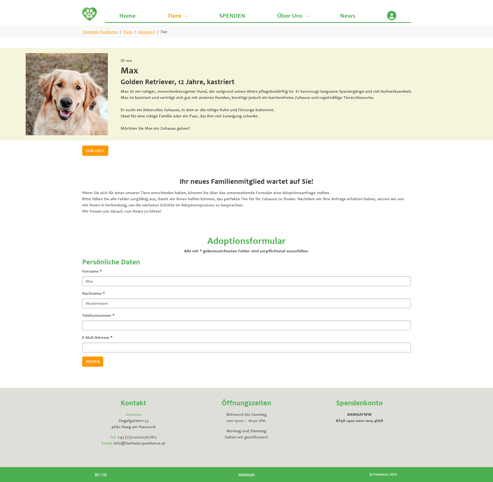
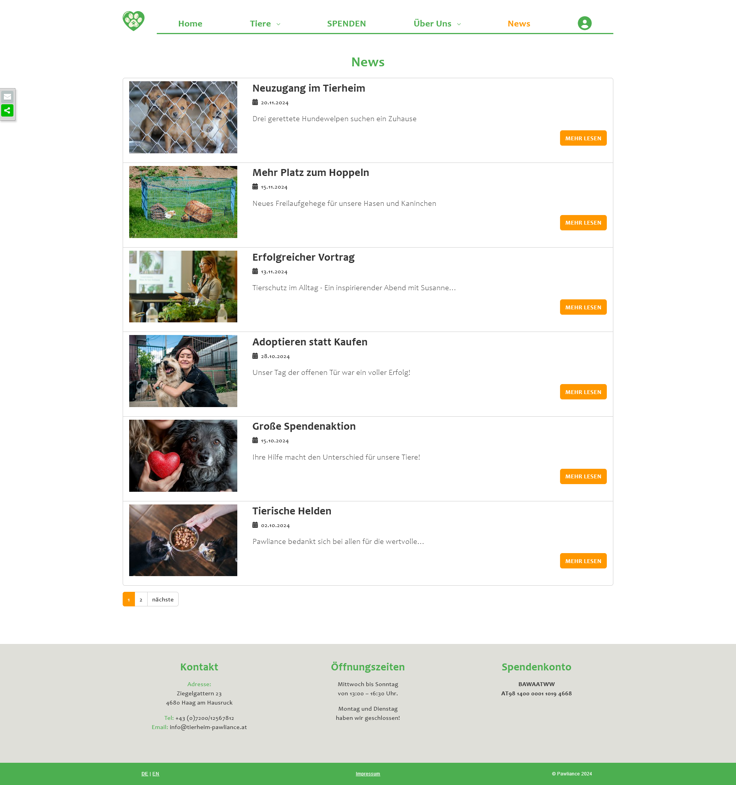
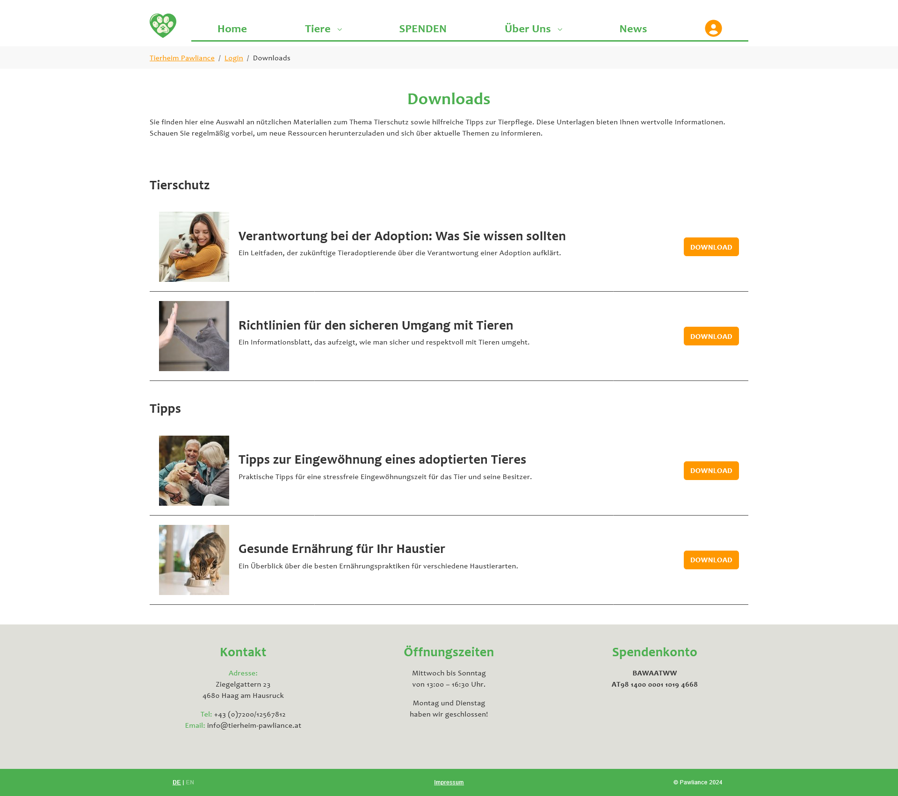

# Pawliance – TYPO3 Animal Shelter Website

Pawliance is a TYPO3 website for a fictional animal shelter focused on the care and adoption of animals such as dogs, cats and small pets. The project was developed as part of the course 'Content Management Systems' during my Bachelor’s degree in Communication, Knowledge & Media at University of Applied Sciences Upper Austria, Campus Hagenberg.

The goal of the project was to design and implement a complete TYPO3 website from concept and wireframes to a custom sitepackage with templates, styling, custom content elements, extensions, forms, user areas and multilingual content.

## About the Project

The website presents the fictional animal shelter Pawliance and provides information about animal adoption, animal surrender, donations, the shelter’s mission, team, contact details and news.

A central focus of the project was the implementation of a TYPO3 sitepackage based on the Bootstrap Package. The project includes custom Fluid templates, adapted partials, custom content elements created with Mask, SCSS styling and JavaScript interaction.

## Features

- TYPO3 sitepackage for a fictional animal shelter website
- Multilingual website structure in German and English
- News section with list and detail views
- Adoption animal overview with detail pages
- Adoption form
- Protected download area for registered users
- Custom content elements created with Mask
- Customized Fluid templates, layouts and partials

## Tech Stack

### CMS

- TYPO3
- TYPO3 Sitepackage
- Bootstrap Package

### Templating and Styling

- Fluid Templates
- TypoScript
- HTML
- SCSS
- Bootstrap

### Extensions and Functionality

- Mask for custom content elements
- News extension
- Frontend user login / protected area
- Multilingual configuration

### Interaction

- JavaScript for the interactive “Animal of the Month” element

## Repository Structure

```text
packages/                   TYPO3 sitepackage and project-specific files

.gitignore                  Git ignore configuration
```

The repository contains the custom TYPO3 sitepackage for the project. The full TYPO3 installation, database and generated system files are not part of this repository.

## Implemented TYPO3 Customizations

### Sitepackage and Templating

The project uses a custom TYPO3 sitepackage based on the Bootstrap Package. It includes custom TypoScript configuration, Fluid templates, layouts and partials.

Several Bootstrap Package templates and partials were adapted to match the design concept, including changes to the navigation, footer, carousel layout and language menu.

### Custom Content Elements

The project includes multiple custom content elements created with Mask, including:

- Team member cards
- Animal information elements
- Download elements for the protected area
- “Animal of the Month” highlight element

The “Animal of the Month” element includes a JavaScript-based flip interaction. When users click on the overlay, it flips and reveals additional information and a link to the animal profile or adoption form.

### News and Adoption Animals

The TYPO3 News extension was used for regular news articles and for managing adoptable animals. This allowed the project to use list and detail views, categories and customized templates for the animal adoption section.

### Multilingual Website

The website is available in German and English. The project includes a customized language menu using language abbreviations and a multilingual content structure.

## My Contribution

This project was implemented by me as part of the university course 'Content Management Systems'.

My work included concept development, wireframing, visual design, TYPO3 sitepackage setup, TypoScript configuration, Fluid template customization, SCSS styling, creation of custom content elements with Mask, integration and customization of extensions, multilingual setup, frontend user area, form integration and documentation.

## Screenshots

### Home Page



### Adoption Overview



### Animal Detail Page



### News Section



### Team Page


### Protected Download Area



### Animal of the Month


## Live Demo

A live demo is currently hosted on a university subdomain:

[Open Live Demo](http://tierheim-pawliance.s2310456005.student.kwmhgb.at)

Please note that the university hosting may only be available until the completion of my degree. Screenshots are therefore included in this repository as a permanent project documentation.

## Local Setup

This repository contains the custom TYPO3 sitepackage only. It does not contain a complete TYPO3 installation or database dump.

To use the sitepackage in a TYPO3 installation, the package has to be included in a compatible TYPO3 project and activated in the TYPO3 backend.

### Clone the repository

```bash
git clone https://github.com/Johanna299/Pawliance.git
cd Pawliance
```

## Project Context

This application was created for educational purposes as part of the course 'Content Management Systems'. The assignment focused on designing and implementing a TYPO3 website with a custom sitepackage, responsive design, custom content elements, news integration, a form, a protected user area and multilingual content.
